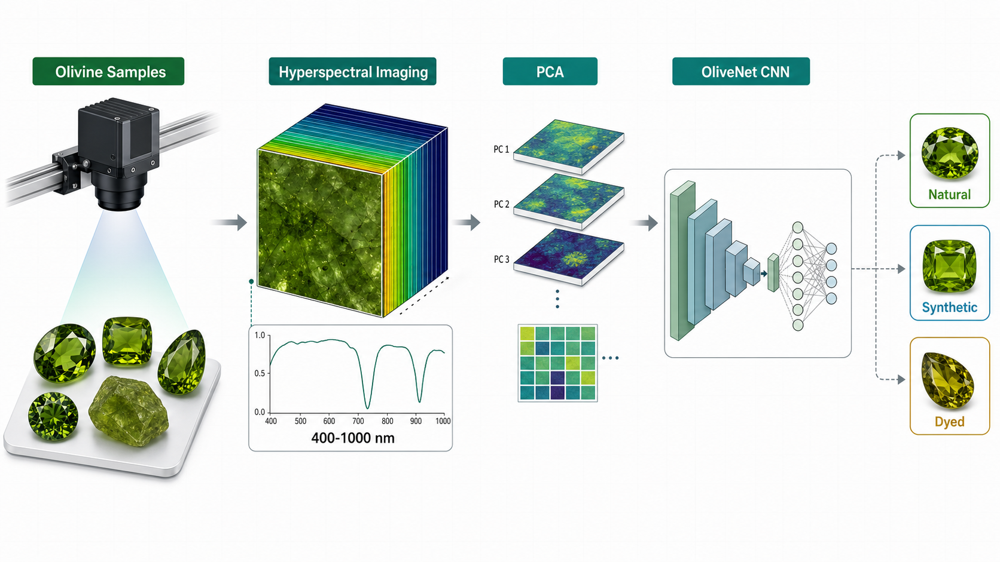
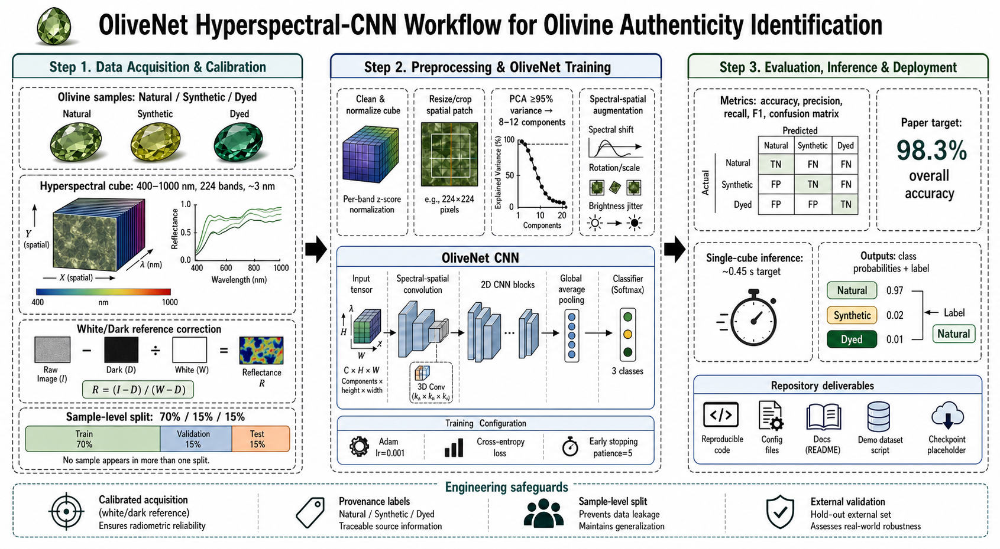

# OliveNet: Rapid Gemstone Authenticity Identification



This repository turns the paper **"Research on a Rapid Gemstone Authenticity Identification Method Based on Hyperspectral Imaging and Convolutional Neural Network"** into a reproducible engineering project.

The project implements a practical pipeline for olivine authenticity identification from hyperspectral imaging data:

1. convert raw hyperspectral cubes to reflectance;
2. repair/normalize cubes and reduce spectral dimensionality with PCA;
3. train a lightweight CNN, **OliveNet**, for `natural`, `synthetic`, and `dyed` olivine classification;
4. run single-sample inference and export metrics.

## Technical Workflow



The workflow above summarizes the paper-to-code path implemented in this repository: calibrated hyperspectral acquisition, PCA-based spectral compression, OliveNet training, evaluation, and single-cube inference.

## Paper-To-Code Mapping

| Paper component | Implemented location |
| --- | --- |
| White-board reflectance correction | `src/gemstone_hsi/preprocessing.py` |
| PCA dimensionality reduction to 8-12 components | `src/gemstone_hsi/preprocessing.py` |
| Spectral/spatial augmentation | `src/gemstone_hsi/dataset.py` |
| Lightweight OliveNet CNN | `src/gemstone_hsi/model.py` |
| Adam + CE loss + early stopping training loop | `src/gemstone_hsi/train.py` |
| Single-sample prediction | `src/gemstone_hsi/predict.py` |
| Synthetic demo dataset | `scripts/create_demo_dataset.py` |

## Dataset Layout

Place real hyperspectral cubes under `data/raw/`:

```text
data/raw/
  natural/
    sample_001.npy
  synthetic/
    sample_001.npy
  dyed/
    sample_001.npy
  calibration/
    white.npy
    dark.npy
```

Each cube should be a NumPy array with shape `(height, width, bands)`, for example `(512, 512, 224)`. If calibration files are available, use `white.npy` and optionally `dark.npy` for reflectance correction.

For GitHub, keep large real data out of the repository. Store a small public example in `data/sample/` or publish the full dataset via a release, Zenodo, Kaggle, or an institutional data link.

## Quick Start

```bash
python3 -m venv .venv
source .venv/bin/activate
pip install -r requirements.txt
pip install -e .

python scripts/create_demo_dataset.py --output data/demo --samples-per-class 12
python -m gemstone_hsi.train --config configs/demo.yaml
python -m gemstone_hsi.predict --checkpoint outputs/demo/best_model.pt --cube data/demo/natural/natural_000.npy
```

The demo data is synthetic and exists only to prove that the pipeline runs end to end. Replace it with real hyperspectral olivine cubes before reporting scientific results.

For real raw camera cubes, pass calibration references during inference:

```bash
python -m gemstone_hsi.predict \
  --checkpoint outputs/real/best_model.pt \
  --cube data/raw/natural/sample_001.npy \
  --white data/raw/calibration/white.npy \
  --dark data/raw/calibration/dark.npy
```

## Project Structure

```text
configs/                 Training and preprocessing configs
data/                    Local data directory, ignored except placeholders
docs/                    Paper implementation notes
models/                  Optional exported model files
outputs/                 Training outputs, ignored by Git
scripts/                 Utility scripts
src/gemstone_hsi/        Python package
tests/                   Lightweight tests
```

## Reproducing The Paper Setup

The paper describes:

- spectral range: `400-1000 nm`;
- spectral resolution: `3 nm`;
- original bands: `224`;
- PCA components: keep cumulative explained variance `>= 95%`, typically `8-12`;
- classes: `natural`, `synthetic`, `dyed`;
- split: `70% train`, `15% validation`, `15% test`;
- optimizer: Adam, initial learning rate `0.001`;
- training: up to `50` epochs, early stopping patience `5`;
- augmentation: spectral shift, rotation/scale, brightness jitter;
- target single-sample inference: about `0.45 s`.

See [docs/implementation_plan.md](docs/implementation_plan.md) for the engineering interpretation and next steps for publishing this as a polished GitHub project.

## Important Notes

This repository provides a reproducible implementation of the method, not a certified gemological instrument. Real deployment requires calibrated acquisition hardware, validated sample provenance, controlled illumination, and external testing by qualified gemology experts.
